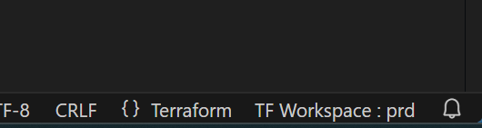
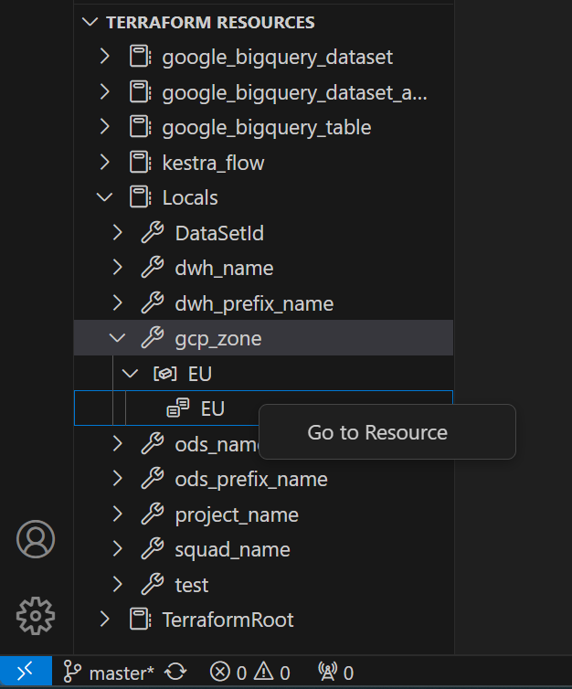
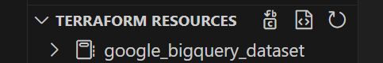
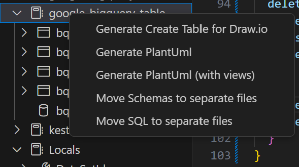

# Features Descriptions

## Terraform Worskpace Selector

After configuring the `bqtf.workspaces` & `bqtf.defaultWorkspace` settings in your VSCode, you'll be able to choose a Terraform workspace. This workspace selection will be used when dry-running queries or replacing locals, among other operations.

You'll find a 'TF Workspace:' indicator at the bottom right side of your editor.

<center>


</center>
Click on it to select a workspace using a VSCode Quick Pick. The chosen workspace will be visible in the selector.

## Terraform Resources View

In the primary side bar, a new view named "Terraform Resources" will appear.
<center>


</center>
You can expand the nodes and right click on a resource to access its declaration in the editor.

A the top of the view, you'll find 3 buttons:
<center> 


</center>

The last button is used to refresh the resources tree. You need to refresh the tree when you make changes (add, remove, or modify code) and want to use an extension functionality. This is because there is significant code parsing involved, so it was designed to be 'on-demand.'

The other two buttons are meant for SQL files:

The first one will replace every local in the file with its computed value.
The second one will attempt to do the opposite, using locals where poss

## Move inline SQL and Schema into separate files

If you wrote your SQL or Schema declaration in the same file as your terraform google_bigquery_table resource, you can extract those declaration into separated file within a directory of your choice.

The following syntax is supported :
<center>


</center>

The following syntax is NOT supported: 

```
query = "select any_field from `my_project.my_dataset.my_table`"
```

Right-click on 'google_bigquery_table' in the Terraform Resource tree and select either

- Move Schemas to separate files
- Move SQL to separate files

## BigQuery Dry Run

A Dry Run tests a SQL query and provides information on how much data will be processed. This functionality is equivalent to the indicator located at the top right side of your BigQuery console. You will need to initiate it manually.

When working with a .sql file, you have two options to perform a dry run on a query:

- A button available on your VSCode Status Bar
- A right-click option within your SQL Code

If you have already declared your view in Terraform and used the templatefile function for the "query" parameter, the extension will attempt to replace the Terraform values where possible before executing the dry run. It's important to refresh your Terraform Resource tree before initiating the dry run process. The terraform workspace selector allows you to change the terraform.workspace value.
<center>


</center>

If an error occurs during the dry run, a red dot will appear at the corresponding line in the gutter. This functionality operates effectively when BigQuery provides a position, and it's important to note that BigQuery only returns the details of the first error encountered.

## View Schema reverse engineering

To initiate the process, right-click in your SQL Code and choose 'Reverse Table Schema'. Your file should have the .sql extension for this option to show.

This action will trigger a dry run of your query and fetch the JSON Schema. An empty description field will be automatically added.

If you have previously defined your view in Terraform and specified a path for the schema, the file will either be created or updated accordingly. However, if no schema has been declared, the file will remain untitled, and you will need to select the path and provide a filename when saving it.

## Generate SQL statement

This option generates the corresponding select statement that includes all the fields in the schema.

To initiate the process, right-click in a JSON Schema file and choose 'Generate a select all from this schema'. Your file should have the .json extension for this option to show.
<center>


</center>

## Generate SQL statement for an existing table

This option generates the corresponding select statement that includes all the fields in the table or view.

To initiate the process, press CTRL-SHIFT-P, type `bqtf`, and select `BQTF: Generate a select all from a table Id`
<center>


</center>

You'll be asked to input the fully qualified name of the table or view. It will open a new file with the select statement.

## Auto-declare google_bigquery_table resource

While inside a `.sql` or `.json` file, right-click and select `Declare this view/table in Terraform Files`.

This action will generate the `google_bigquery_table` resource and prompt you with several questions:

For Tables and Views:
- Dataset Id: It will display a list of declared `google_bigquery_dataset` resources or allow you to input one `*`.
- Project Id: It will show a list of locals and the `google_bigquery_dataset` you chose in the previous step, if applicable, or allow you to input one `*`.

For Tables Only:
- Partition field: It will show a list of eligible time partitioning fields.
- Cluster fields: It will display a list of eligible cluster fields, allowing for multiple selections `**`.

`*`: The behavior may change if `bqtf.autoDataset` settings are enabled. If set to true, you won't be prompted to choose a dataset if there is only one declared in the VSCode workspace.

`**`: The cluster fields will be ordered as displayed in the Quick Pick interface, and you have the option to reorganize them.

Several settings influence the behavior of this functionality:

- `bqtf.preferredViewLocation`: Sets the view wizard behavior, allowing you to store the declaration in [one, many] files. Choosing 'many' will create a dedicated `.tf` file for each resource.
- `bqtf.viewFile`: Sets the name of the view wizard target file when the preferred view location is set to 'one'.
- `bqtf.preferredTableLocation`: Sets the table wizard behavior, allowing you to store the declaration in [one, many] files. Choosing 'many' will create a dedicated `.tf` file for each resource.
- `bqtf.tableFile`: Sets the name of the table wizard target file when the preferred view location is set to 'one'.

## Generate Conceptual Data Model

There are two different possibilities if you want to generate a Conceptual Data Model.

The first option is to use draw.io (diagrams.net) for creating a schema. The main drawback is that draw.io doesn't handle the relationships, so you'll end up with tables and views without their connections.

The second option leverages the power of PlantUML. This option handles the relationships, but the main drawback here is that PlantUML generates an image that you can't edit. The positions are automatically defined by the tool, which can lead to poor readability.

The script will parse the declared Terraform resources and analyze the table/view schemas. It expects to find some information in the descriptions.

To define a primary key, you need to add the following text in the description:

Primary Keys:

- `[UPK]`: When you have a single field for your primary key.
- `[PKx]`: When you have multiple fields making up your primary key (where 'x' is a number, e.g., [PK2]).

Foreign Keys:

- `[FK - table_name - field_name ]`: If the field is a foreign key, declare the foreign table and foreign field. If the table is in another dataset, you may skip the field name.

Partition and Cluster fields will be identified through the Terraform `google_bigquery_table` declaration.

Right-click on the `google_bigquery_table` resources type or directly on a resource and choose between : 


- Generate Create Table for Draw.io
- Generate PlanUml
- Generate PlanUml (with views)

<center>


</center>

A new text editor will show up with some code to paste in plantUml or Draw.io.